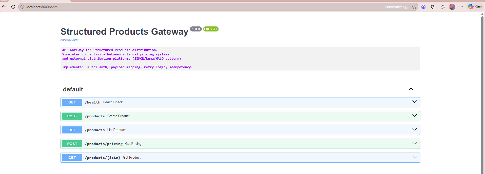
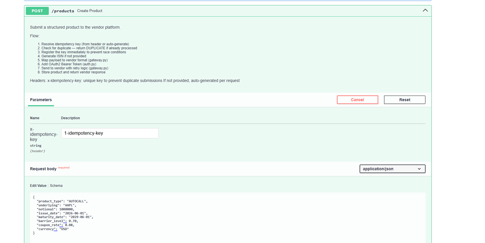
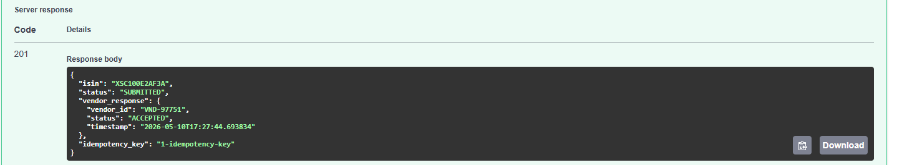
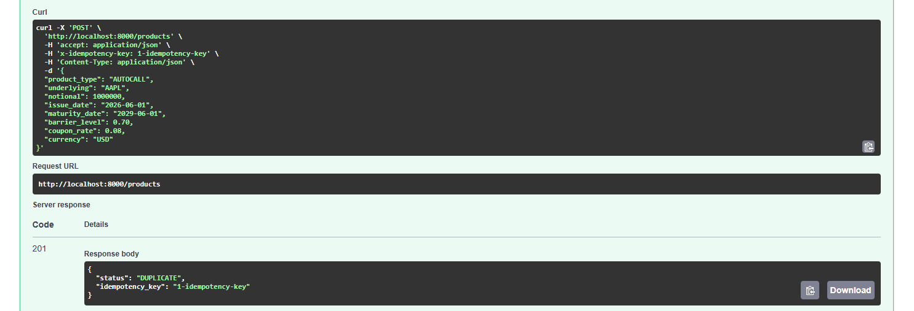
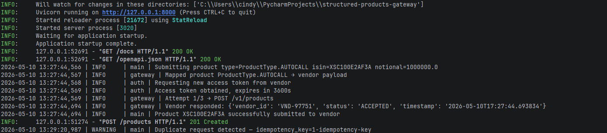

# Structured Products API Gateway

Enterprise-grade REST API gateway simulating connectivity
between a bank's internal pricing system and external
structured products distribution platforms.

Mirrors the integration architecture used between
bank systems (Murex) and platforms like SIMON, Luma, and HALO.


## Business Context

Banks create structured products — Autocalls, Reverse Convertibles,
Capital Protected Notes — for institutional clients.
To distribute these products via platforms like SIMON or Luma,
their internal systems must connect via authenticated,
resilient API integrations.

This gateway simulates that connectivity layer:
authentication, payload translation, error handling,
and duplicate prevention.

## Architecture

```
Bank Internal System (Murex)
        ↓
  [API Gateway]
  ├── OAuth2 Authentication (auth.py)
  ├── Payload Mapping — internal → vendor format (gateway.py)
  ├── Retry Logic + Exponential Backoff (gateway.py)
  ├── Idempotency Key Validation (main.py)
  └── Request/Response Validation (models.py)
        ↓
  Vendor Platform (SIMON / Luma / HALO)
```

## Features

- OAuth2 bearer token authentication with automatic renewal
- Payload mapping between internal and vendor data formats
- Retry logic with exponential backoff (3 attempts, 1/2/4s)
- Idempotency keys to prevent duplicate submissions
- Pydantic validation for all structured product payloads
- Pricing requests with Greeks (delta, gamma, vega)
- ELK-ready structured logging

## Structured Products Covered

| Product | Description |
|---|---|
| Autocall | Early redemption if barrier breached on observation date |
| Reverse Convertible | High coupon, equity downside if barrier breached |
| Capital Protected Note | 100% capital protection + upside participation |

## Tech Stack

```
Python 3.11
FastAPI
Pydantic v2
Uvicorn
httpx
```

## Run

```bash
pip install -r requirements.txt
uvicorn main:app --reload
```

Docs → http://localhost:8000/docs

## Design Decisions

**Why idempotency keys in headers, not body?**
Industry standard (Stripe, SIMON, Adyen) — idempotency
is a transport-layer concern, not business data.

**Why exponential backoff?**
Vendor platforms under load should not be flooded
with retries. Doubling wait time reduces cascading failures.

**Why separate gateway.py from main.py?**
Separation of concerns — transport logic isolated from
business logic. Easier to test, mock, and extend.

## Screenshots







## Possible Improvements

- Add real OAuth2 endpoint integration (Azure AD, Okta)
- Persist products to PostgreSQL instead of in-memory store
- Add Prometheus metrics endpoint for monitoring
- Implement circuit breaker pattern for vendor downtime